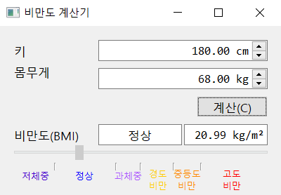

# PYSIDE2-BMICALC

이 프로그램은 본인의 전공과목 기말고사 결과물로 제출하였던 프로그램입니다.

## 사용방법
프로그램을 실행한 후 키와 몸무게를 입력하고 계산 버튼을 누르면 아래에 BMI 지수와 비만 정도를 그래프로 표시해줍니다.  
BMI 지수에 따른 비만도는 다음과 같습니다.  
* **저체중**: *i* < 18.5 
* **정상**: 18.5 ≤ *i* < 23 
* **과체중**: 23 ≤ *i* < 25 
* **경도비만**: 25 ≤ *i* < 27.5 
* **중등도비만**: 27.5 ≤ *i* < 30 
* **고도비만**: 30 ≤ *i* 

## 라이센스
이 프로그램 및 소스코드는 퍼블릭 도메인으로 배포됩니다.
아무 제한 없이 사용, 수정 및 재배포할 수 있습니다.
